<div align="center">

<picture>
  <source media="(prefers-color-scheme: dark)" srcset="./dark.svg">
  <source media="(prefers-color-scheme: light)" srcset="./light.svg">
  
</picture>

</div>

## About

I'm a software developer passionate about building practical and user-friendly applications. I work across frontend, UI/UX design and full-stack development, with a focus on clean, intuitive, and user-focused digital experiences.

- Currently working as Office Staff at DM8 Composites, Danao, Cebu
- Focus areas: Web Development, UI/UX Design, Frontend Development
- Portfolio: in progress

## Featured Projects

| Project | Description |
| --- | --- |
| Biometric Integrated Timekeeping System | Full-stack attendance management platform with biometric device integration, role-based access control, and automated attendance tracking. |
| UNITrack | Uniform tracking for Cebu Technological University - Danao Campus. |
| Personal Task Manager | Task management application for organizing daily tasks. |

## Tech Stack


## Education

- **Bachelor of Science in Information Technology**, Cebu Technological University - Danao Campus (2022 - 2026)
- **National Certificate II in Creative Web Design** (July 2024 - August 2024)

## Connect

[GitHub](https://github.com/yvonnete) · [Discord](https://discord.com/users/666152682330914826) · [Email](mailto:athenayvonnete@gmail.com)

```bash
$ npm install motivation
```
            
